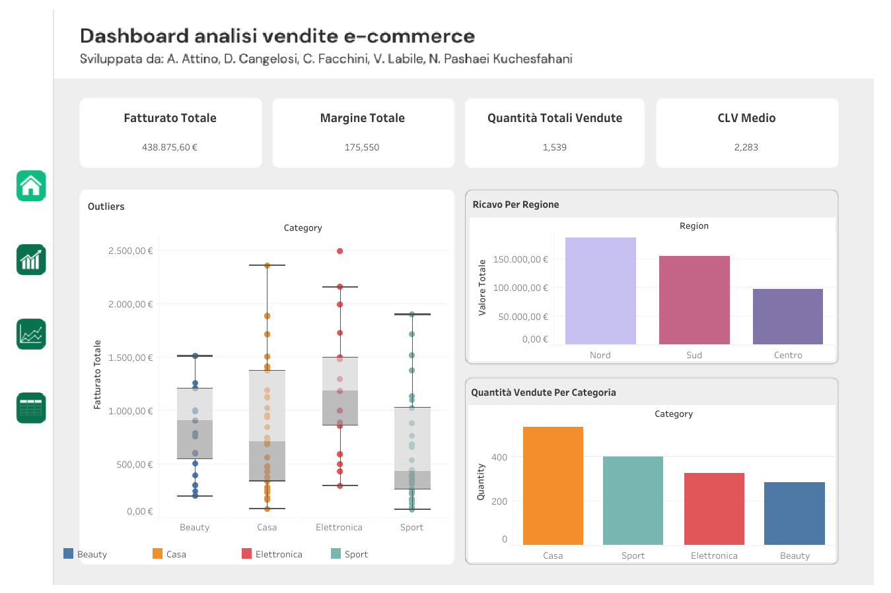
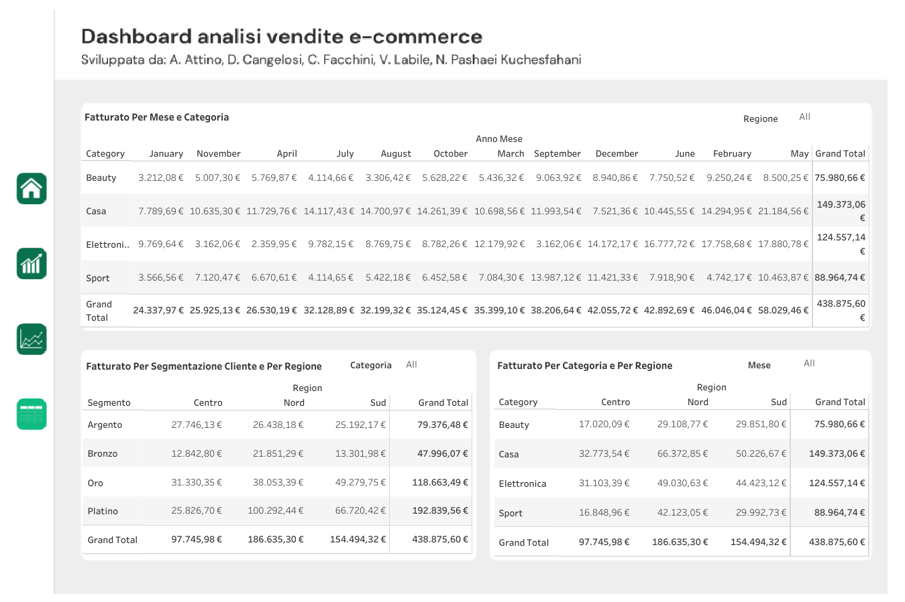

# E-commerce Database Analysis Project

This project contains a comprehensive data analysis of an e-commerce database, performed as a **group case study** for Data analyst course by Riverloop(Forma.Temp).

The analysis is divided into two parts:

## 1. SQL Preliminary Exploration

* **File:** `analisi-preliminare-sql-e-commerce-database.ipynb`
* **Purpose:** Exploratory data analysis (EDA) using SQL queries to understand key metrics like **sales over time**, **return rates**, **total customer count**, and **average order value (AOV)**. Identifying the top and bottom **products and product categories** by revenue and volume for early business recommendations.

## 2. Python Advanced Analysis(ETL and EDA with Python)

* **File:** `Analisi_Python_E_commerce_database.ipynb`
* **Purpose:** Advanced data manipulation using Pandas, feature engineering, and customer segmentation using **RFM Analysis** and **K-Means Clustering** to identify high-value customer groups and provide business recommendations.

## Visualizations

The key findings and dynamic dashboards are presented in the public Tableau workbook:

* **Tableau Public Link:** https://public.tableau.com/views/Dashboardanalisivenditee-commerce_17655692610910/Home?:language=en-US&:sid=&:redirect=auth&:display_count=n&:origin=viz_share_link

### Immagini Statiche di Risultato

Qui di seguito sono riportate alcune immagini statiche generate durante l'analisi per chiarezza e riproducibilità.

## Data

The six required input files (`customers.csv`, `orders.csv`, etc.) are included in the `data/` subdirectory for reproducibility.

## Group Context

This project was a collaborative effort with Alessandro Attino, Delia Cangelosi,Chiara Facchini, Vittoria Labile and Nastaran Pashaei Kuchesfahani.
